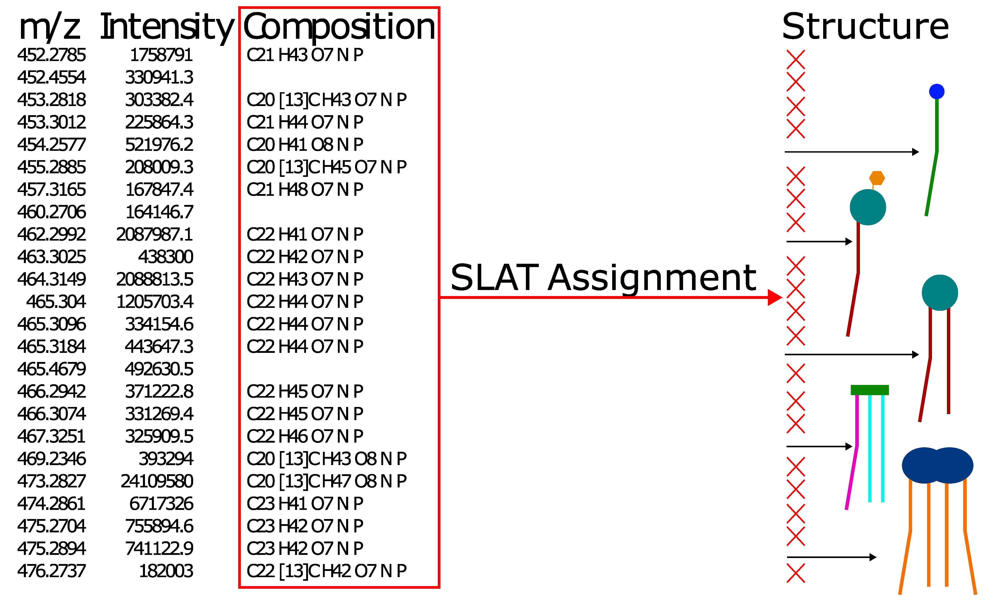
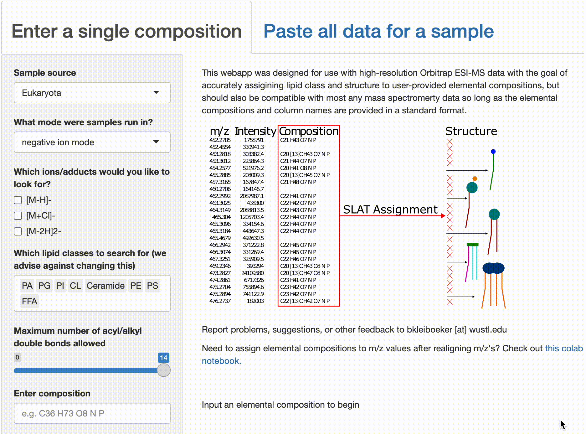

# SLAT - <ins>S</ins>hotgun <ins>L</ins>ipidomics <ins>A</ins>ssignment <ins>T</ins>ool

[This webapp](https://briankleiboeker.shinyapps.io/structure_from_comp/) was designed for use with high-resolution Orbitrap ESI-MS data with the goal of accurately assigining lipid class and structure to user-provided elemental compositions, but should also be compatible with most any mass spectromerty data so long as the elemental compositions and column names are provided in a standard format.

To use SLAT, see the below demonstrations:

For muliple compositions:
