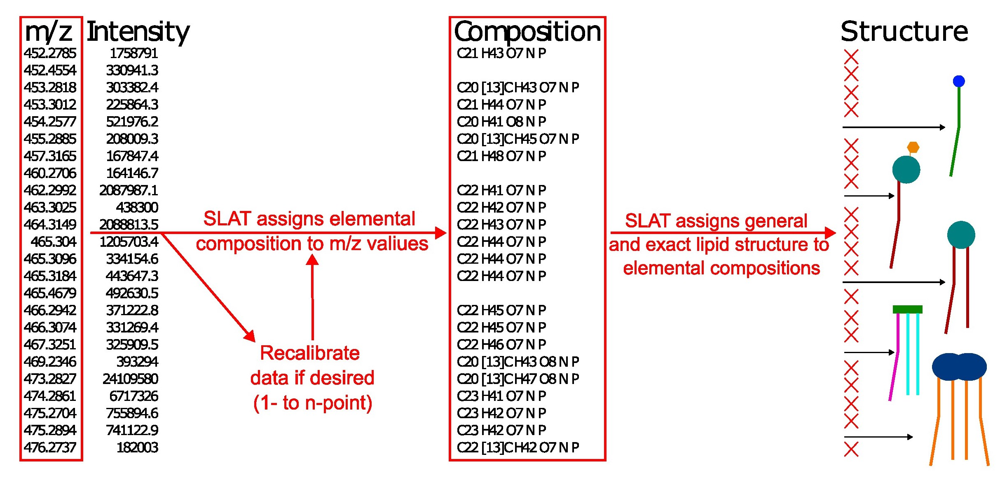

# SLAT - <ins>S</ins>hotgun <ins>L</ins>ipidomics <ins>A</ins>ssignment <ins>T</ins>ool #

[This webapp](https://lodhilab.shinyapps.io/slat/) was designed for use with high-resolution Orbitrap ESI-MS data with the goal of accurately assigining lipid class and structure to user-provided elemental compositions, but should also be compatible with most any mass spectromerty data so long as the elemental compositions and column names are provided in a standard format.

To use SLAT to assign lipid structure to a single elemental composition:

For muliple elemental compositions (a test dataset is available in this repository):

## Change log ##
* v1.0.0 Release SLAT
* v1.0.1 Add exact structure database. SLAT now returns most likely exact structures for over 200 general structures. The exact structure database is based on hundreds of MS2 and MS3 analyses of lipids from various tissues and cell lines.
